# Microsoft Graph ASP.NET Webhooks

Subscribe for [Microsoft Graph webhooks](https://developer.microsoft.com/en-us/graph/docs/api-reference/v1.0/resources/webhooks) to be notified when your user's data changes so you don't have to poll for changes.

This ASP.NET MVC sample shows how to start getting notifications from Microsoft Graph. Microsoft Graph provides a unified API endpoint to access data from the Microsoft cloud.

> This sample uses the Azure AD V2 endpoint to obtain an access token for work or school accounts. The sample uses a user-delegated permission, but messages, events, and contacts resources also support application (app-only) permissions. Currently, only drive root item resources support subscriptions for personal accounts. Watch the docs as we continue to add support for these and other features.

The following are common tasks that an application performs with webhooks subscriptions:

- Get consent to subscribe to users' resources and then get an access token.
- Use the access token to [create a subscription](https://developer.microsoft.com/en-us/graph/docs/api-reference/v1.0/api/subscription_post_subscriptions) to a resource.
- Send back a validation token to confirm the notification URL.
- Listen for notifications from Microsoft Graph and respond with a 202 status code.
- Request more information about changed resources using data in the notification.

This screenshot shows the app's start page after the user signs in.

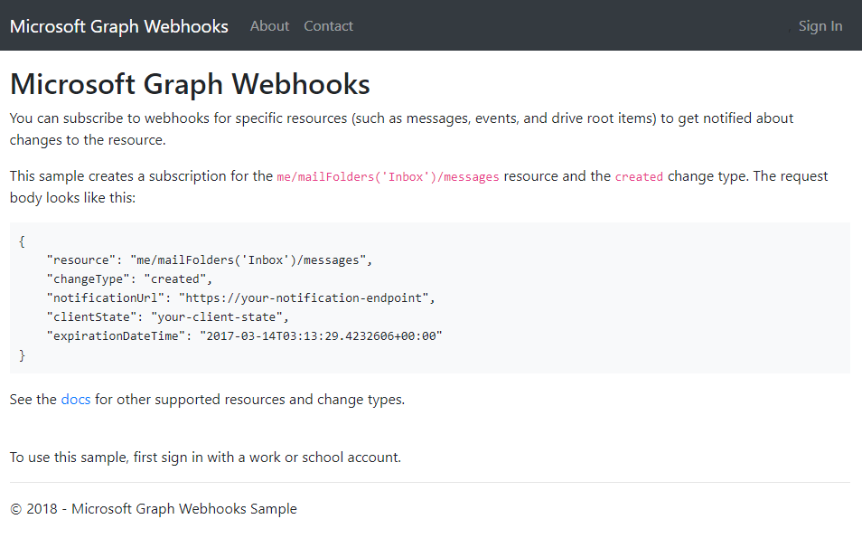

After the app creates a subscription on behalf of the signed-in user, Microsoft Graph sends a notification to the registered endpoint when events happen in the user's data. The app then reacts to the event.

This sample subscribes to the `me/mailFolders('Inbox')/messages` resource for `created` changes. It gets notified when the user receives an email message, and then updates a page with information about the message.

## Prerequisites

To use the Microsoft Graph ASP.NET Webhooks sample, you need the following:

- Visual Studio 2017 installed on your development computer.
- A [work or school account](http://dev.office.com/devprogram).
- The application ID and key from the application that you [register on the Application Registration Portal](#register-the-app).
- A public HTTPS endpoint to receive and send HTTP requests. You can host this on Microsoft Azure or another service, or you can [use ngrok](#set-up-the-ngrok-proxy-optional) or a similar tool while testing.

### Register the app
In this exercise, you will create a new Azure AD web application registration using the Azure Active Directory admin center.

1. Determine your ASP.NET app's URL. In Visual Studio's Solution Explorer, select the **GraphWebhooks** project. In the **Properties** window, find the value of **SSL URL**. Copy this value.

    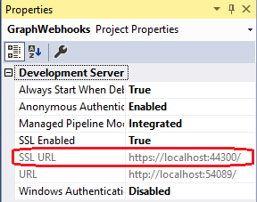

1. Open a browser and navigate to the [Azure Active Directory admin center](https://aad.portal.azure.com). Login using a **Work or School Account**.

1. Select **Azure Active Directory** in the left-hand navigation, then select **App registrations (Preview)** under **Manage**.

    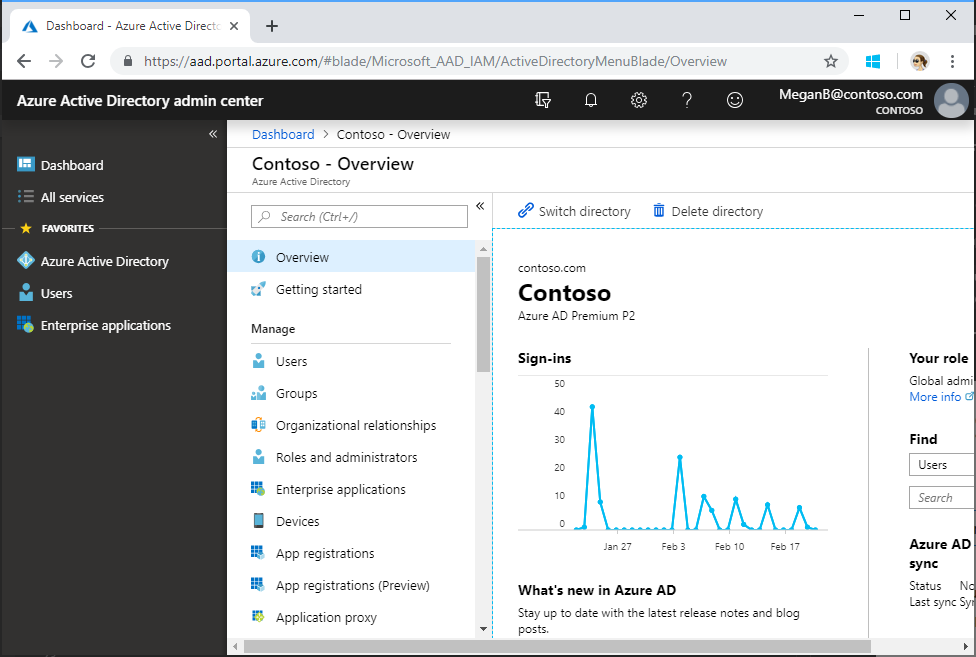

1. Select **New registration**. On the **Register an application** page, set the values as follows.

    - Set a preferred **Name** e.g. `GraphWebhooks Sample`.
    - Set **Supported account types** to **Accounts in any organizational directory**.
    - Under **Redirect URI**, set the first drop-down to `Web` and set the value to the ASP.NET app SSL URL you copied in step 1.

    

1. Choose **Register**. On the **GraphWebhooks Sample** page, copy the value of the **Application (client) ID** and save it, you will need it in the next step.

    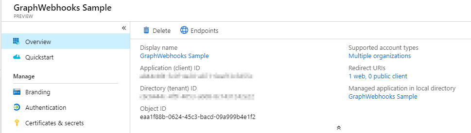

1. Select **Authentication** under **Manage**. Locate the **Implicit grant** section and enable **ID tokens**. Choose **Save**.

    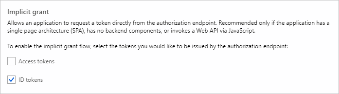

1. Select **Certificates & secrets** under **Manage**. Select the **New client secret** button. Enter a value in **Description** and select one of the options for **Expires** and choose **Add**.

    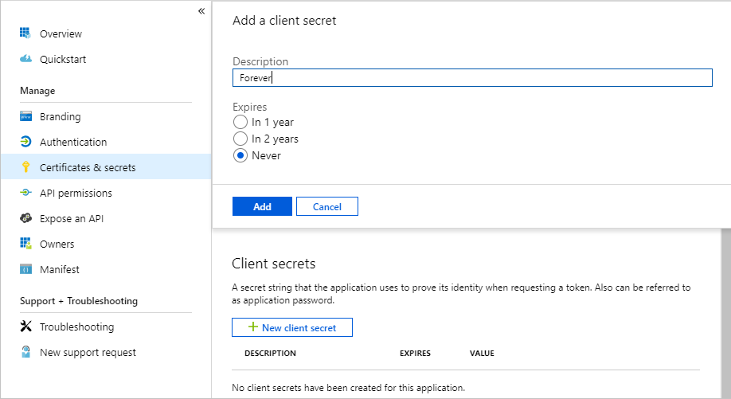

1. Copy the client secret value before you leave this page. You will need it in the next step.

    > [!IMPORTANT]
    > This client secret is never shown again, so make sure you copy it now.

    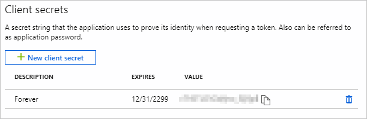

1. From the **Manage** page, select **API permissions** > **Add a permission**.

    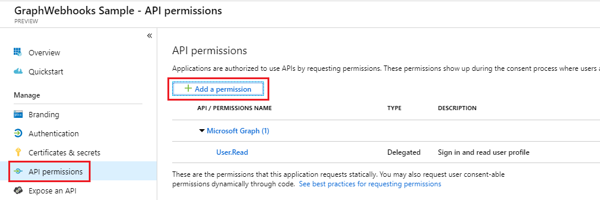

1. Choose **Microsoft API** > **Microsoft Graph**.

    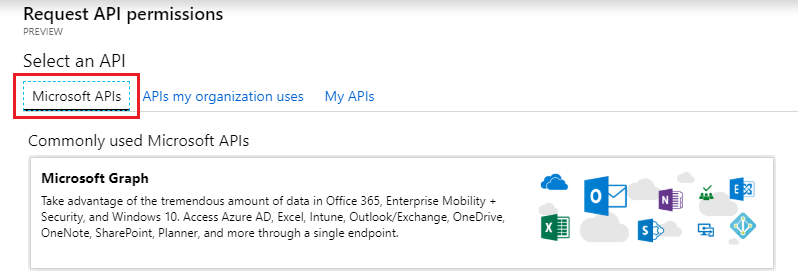

1. Choose **Delegated permissions**. In the search box, type **Mail.Read** and select the first option from the list. Select **Add permissions**.

    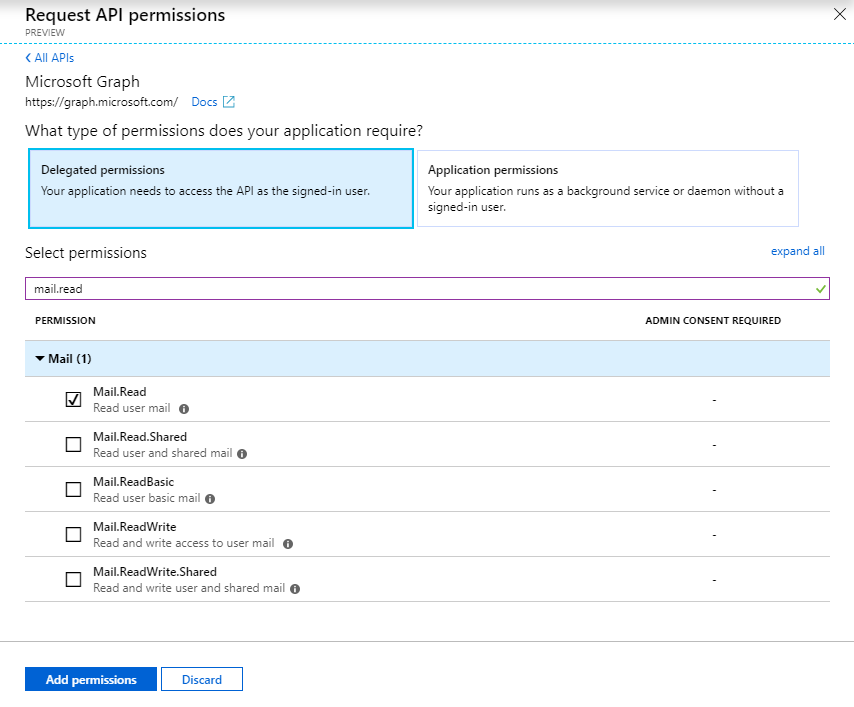


### Set up the ngrok proxy (optional)

You must expose a public HTTPS endpoint to create a subscription and receive notifications from Microsoft Graph. While testing, you can use ngrok to temporarily allow messages from Microsoft Graph to tunnel to a *localhost* port on your computer.

You can use the ngrok web interface ([http://127.0.0.1:4040](http://127.0.0.1:4040)) to inspect the HTTP traffic that passes through the tunnel. To learn more about using ngrok, see the [ngrok website](https://ngrok.com/).

1. In Solution Explorer, select the **GraphWebhooks** project.

1. Copy the **URL** port number from the **Properties** window. If the **Properties** window isn't showing, choose **View > Properties Window**.

    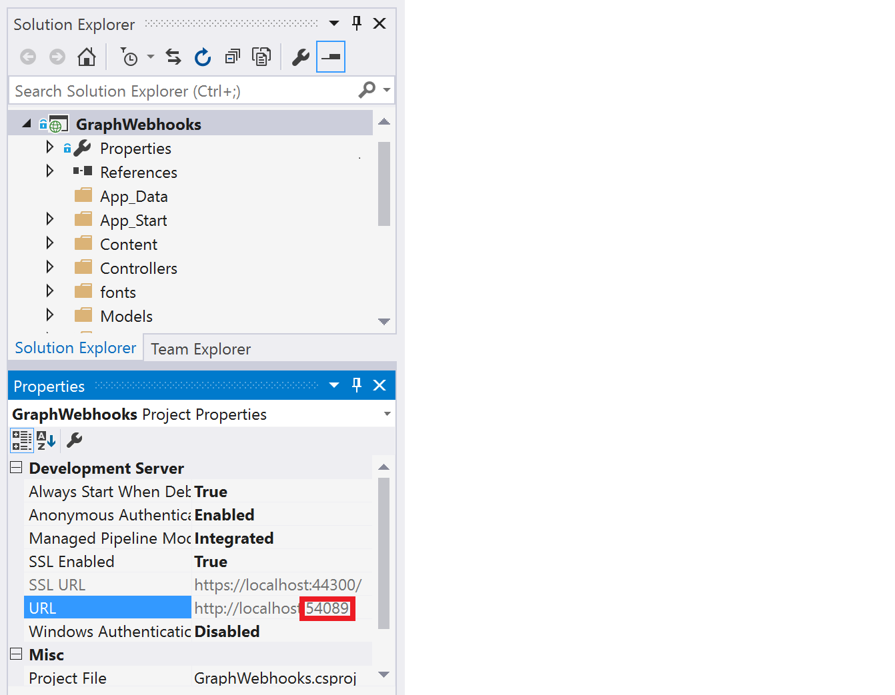

1. [Download ngrok](https://ngrok.com/download) for Windows.

1. Unzip the package and run ngrok.exe.

1. Replace the two *{port-number}* placeholder values in the following command with the port number you copied, and then run the command in the ngrok console.

    ```Shell
    ngrok http {port-number} -host-header=localhost:{port-number}
    ```

    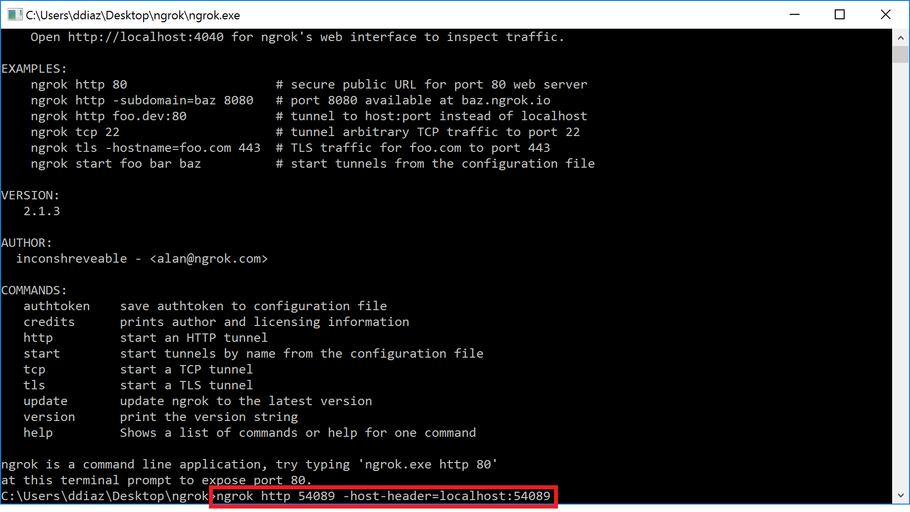

1. Copy the HTTPS URL that's shown in the console. You'll use this to configure your notification URL in the sample.

    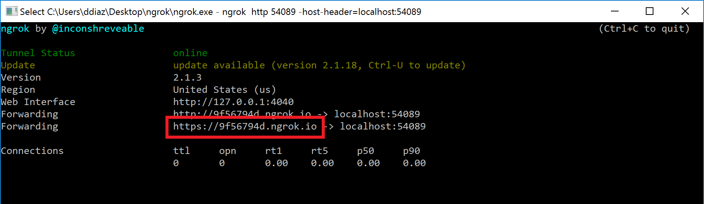

    > **Note:** Keep the console open while testing. If you close it, the tunnel also closes and you'll need to generate a new URL and update the sample.

See [Hosting without a tunnel](https://github.com/microsoftgraph/nodejs-webhooks-rest-sample/wiki/Hosting-the-sample-without-a-tunnel) and [Why do I have to use a tunnel?](https://github.com/microsoftgraph/nodejs-webhooks-rest-sample/wiki/Why-do-I-have-to-use-a-tunnel) for more information.

## Configure and run the sample

1. Expose a public HTTPS notification endpoint. It can run on a service such as Microsoft Azure, or you can create a proxy web server by [using ngrok](#set-up-the-ngrok-proxy-optional) or a similar tool.

1. Make a copy of **GraphWebHooks/PrivateSettings.example.config** in the same directory. Name the copy **PrivateSettings.config**.

1. Open **GraphWebhooks.sln** in the sample files.

    > **Note:** You may be prompted to trust certificates for localhost.

1. In Solution Explorer, open the **PrivateSettings.config** file in the root directory of the project.
    - For the **ClientId** key, replace *ENTER_YOUR_APP_ID* with the application ID of your registered application.
    - For the **ClientSecret** key, replace *ENTER_YOUR_SECRET* with the secret of your registered application.
    - For the **NotificationUrl** key, replace *ENTER_YOUR_URL* with the HTTPS URL. Keep the */notification/listen* portion. If you're using ngrok, use the HTTPS URL that you copied. The value will look something like this:

    ```xml
    <add key="ida:NotificationUrl" value="https://0f6fd138.ngrok.io/notification/listen" />
    ```

1. Make sure that the ngrok console is still running, then press F5 to build and run the solution in debug mode.
    > **Note:** If you get errors while installing packages, make sure the local path where you placed the solution is not too long/deep. Moving the solution closer to the root drive resolves this issue.
    >
    > If you update any dependencies for this sample, **do not update** `System.IdentityModel.Tokens.Jwt` to v5, which is designed for use with .NET Core. Also do not update any of the `Microsoft.Owin` libraries to v4.

### Use the app

1. Sign in with your work or school account.

1. Consent to the **Read your mail** and **Sign you in and read your profile** permissions.

    If you don't see the **Read your mail** permission, choose **Cancel** and then add the **Read user mail** permission to the app in the Azure Portal. See the [Register the app](#register-the-app) section for instructions.

1. Choose the **Create subscription** button. The **Subscription** page loads with information about the subscription.

    > **Note:** This sample sets the subscription expiration to 15 minutes for testing purposes.

    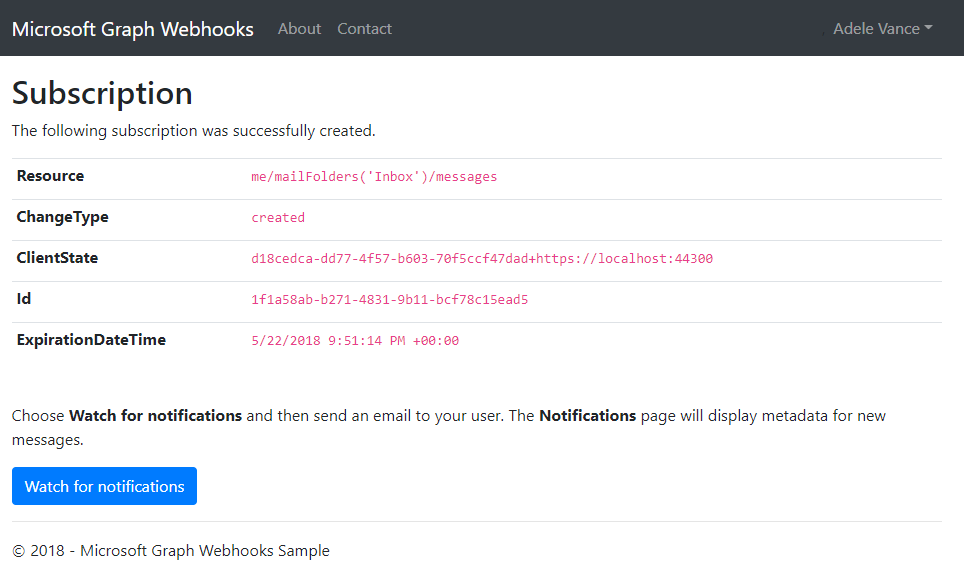

1. Choose the **Watch for notifications** button.

1. Send an email to your work or school account. The **Notification** page displays some message properties. It may take several seconds for the page to update.

    

1. Choose the **Delete subscription and sign out** button.

## Key components of the sample

### Controllers

- [`NotificationController.cs`](GraphWebhooks/Controllers/NotificationController.cs) Receives notifications.
- [`SubscriptionController.cs`](GraphWebhooks/Controllers/SubscriptionController.cs) Creates and receives webhook subscriptions.

### Models

- [`Message.cs`](GraphWebhooks/Models/Message.cs) Defines the **MessageViewModel** that represents the data displayed in the Notification view.
- [`Notification.cs`](GraphWebhooks/Models/Notification.cs) Represents a change notification.
- [`Subscription.cs`](GraphWebhooks/Models/Subscription.cs) Defines the **SubscriptionViewModel** that represents the data displayed in the Subscription view.

### Views

- [`Notification/Notification.cshtml`](GraphWebhooks/Views/Notification/Notification.cshtml) Displays information about received messages, and contains the **Delete subscription and sign out** button.
- [`Subscription/Index.cshtml`](GraphWebhooks/Views/Subscription/Index.cshtml) Landing page that contains the **Create subscription** button.
- [`Subscription/Subscription.cshtml`](GraphWebhooks/Views/Subscription/Subscription.cshtml) Displays subscription properties, and contains the **Watch for notifications** button.

### Other

- [`Web.config`](GraphWebhooks/Web.config) Contains values used for authentication and authorization.
- [`App_Start/Startup.Auth.cs`](GraphWebhooks/App_Start/Startup.Auth.cs) Contains code used for authentication and authorization. The sample uses [OpenID Connect](https://docs.microsoft.com/en-us/azure/active-directory/develop/active-directory-protocols-openid-connect-code) and [Microsoft Authentication Library (MSAL)](https://github.com/AzureAD/microsoft-authentication-library-for-dotnet) to authenticate and authorize the user.
- [`TokenStorage/SampleTokenCache.cs`](GraphWebhooks/TokenStorage/SampleTokenCache.cs) Sample implementation of a token cache that uses System.Runtime.Caching (so that token information is available when a notification is received). Production apps will typically use some method of persistent storage.
- [`Helpers/SubscriptionStore.cs`](GraphWebhooks/Helpers/SubscriptionStore.cs) Access layer for stored subscription information. The sample implementation temporarily stores the info in HttpRuntime.Cache. Production apps will typically use some method of persistent storage.

## Troubleshooting

If you run into errors or problems with the sample, see the [troubleshooting doc](TROUBLESHOOTING.md).

## Contributing

This project has adopted the [Microsoft Open Source Code of Conduct](https://opensource.microsoft.com/codeofconduct/). For more information see the [Code of Conduct FAQ](https://opensource.microsoft.com/codeofconduct/faq/) or contact [opencode@microsoft.com](mailto:opencode@microsoft.com) with any additional questions or comments.

## Questions and comments

We'd love to get your feedback about the Microsoft Graph ASP.NET Webhooks sample. You can send your questions and suggestions to us in the [Issues](https://github.com/microsoftgraph/aspnet-webhooks-rest-sample/issues) section of this repository.

Questions about Microsoft Graph in general should be posted to [Stack Overflow](https://stackoverflow.com/questions/tagged/MicrosoftGraph). Make sure that your questions or comments are tagged with `MicrosoftGraph`.

If you have a feature suggestion, please post your idea on our [User Voice](https://officespdev.uservoice.com/) page, and vote for your suggestions there.

## Additional resources

- [Microsoft Graph Node.js Webhooks sample](https://github.com/microsoftgraph/nodejs-webhooks-rest-sample)
- [Working with Webhooks in Microsoft Graph](https://developer.microsoft.com/en-us/graph/docs/api-reference/v1.0/resources/webhooks)
- [Subscription resource](https://developer.microsoft.com/en-us/graph/docs/api-reference/v1.0/resources/subscription)
- [Microsoft Graph developer site](https://developer.microsoft.com/en-us/graph/)
- [Call Microsoft Graph in an ASP.NET MVC app](https://developer.microsoft.com/en-us/graph/docs/platform/aspnetmvc)

## Copyright

Copyright (c) 2019 Microsoft. All rights reserved.
